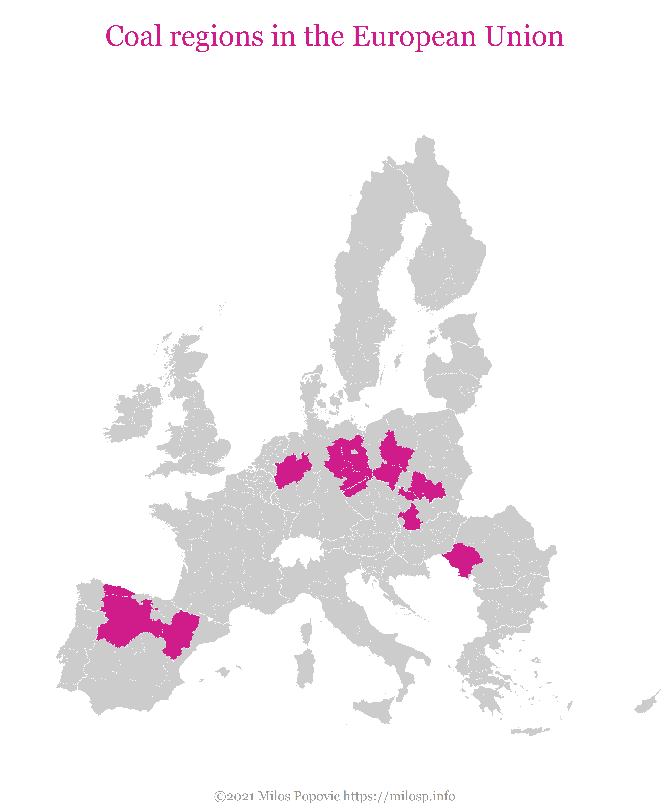

In our use case we are merging data about Europe's coal regions,
harmonized surveys about the acceptance of climate policies, and
socio-economic data. While the work starts out from existing European
research, our
[retroharmonize](https://retroharmonize.dataobservatory.eu/) survey
harmonization solution, our
[regions](https://regions.dataobservatory.eu/) sub-national boundary
harmonization solution and
[iotables](https://iotables.dataobservatory.eu/) allows us to connect
open data and open knowledge from other coal regions of the world, for
example, from the Appalachian economy.

## Policy Context

The [Just Transition
Platform](https://ec.europa.eu/info/strategy/priorities-2019-2024/european-green-deal/actions-being-taken-eu/just-transition-mechanism/just-transition-platform_en#info-centre-and-contacts)
aims to assist EU countries and regions to unlock the support available
through the _Just Transition Mechanism._ It builds on and expands the work
of the existing [Initiative for Coal Regions in
Transition](https://ec.europa.eu/energy/topics/oil-gas-and-coal/EU-coal-regions/secretariat-and-technical-assistance_en),
which already supports fossil fuel producing regions across the EU in
achieving a just transition through tailored, needs-oriented assistance
and capacity-building.

The Initiative has a secretariat that is co-run by [Ecorys](https://www.ecorys.com/), [Climate Strategies](https://climatestrategies.org/), [ICLEI Europe](https://iclei.org/), and the [Wuppertal Institute for Climate](https://wupperinst.org/). While the initiative is an EU project, it
cooperates with other similar initiatives, for example, with the
[Coalfield Development](https://ec.europa.eu/energy/topics/oil-gas-and-coal/EU-coal-regions/resources/rebuilding-appalachian-economy-coalfield-development-usa_en)
social enterprise in the Appalachian economy.

## Data Sources

-   `Coal regions`: Our starting point is the [EU coal regions: opportunities and challenges ahead](https://ec.europa.eu/jrc/en/publication/eur-scientific-and-technical-research-reports/eu-coal-regions-opportunities-and-challenges-ahead)
    publication Joint Research Centre (JRC), the European Commission’s
    science and knowledge service. This publication maps Europe’s coal
    dependent energy and transport infrastructure, and regions that
    depend on coal-related jobs.

-   `Harmonized Survey Data`: The
    [dataset](https://www.gesis.org/en/eurobarometer-data-service/survey-series/standard-special-eb/study-overview/eurobarometer-913-za7572-april-2019)
    of the [Eurobarometer 91.3 (April 2019)]() harmonized survey. Our
    transition policy variable is the four-level agreement with the
    statement
    `More public financial support should be given to the transition to clean energies even if it means subsidies to fossil fuels should be reduced`
    (EN) and
    `Davantage de soutien financier public devrait être donné à la transition vers les énergies propres même si cela signifie que les subventions aux énergies fossiles devraient être réduites`
    (FR) which is then translated to the language use of all
    participating country.

-   `Environmental Variables`: We used [data](https://netzero.dataobservatory.eu/post/2021-03-11-environmental_data/) on pm and SO2 polution
    measured by participating stations in the European Environmental
    Agency’s monitoring program. The station locations were mapped by
    [Milos](https://netzero.dataobservatory.eu/authors/milos_popovic/) to the NUTS sub-national regions.

## Exploratory Data Analysis

Our coal-dependency dummy variable is base on the policy document [Coal regions in
transition](https://ec.europa.eu/energy/topics/oil-gas-and-coal/EU-coal-regions/coal-regions-transition_en).

    readRDS(file.path("data", "coal_regions.rds"))

    ## # A tibble: 253 x 5
    ##    country_code_is~ region_nuts_nam~ region_nuts_cod~ coal_region is_coal_region
    ##    <chr>            <fct>            <chr>            <chr>                <dbl>
    ##  1 BE               Brussels hoofds~ BE10             <NA>                     0
    ##  2 BE               Liege            BE33             <NA>                     0
    ##  3 BE               Brabant Wallon   BE31             <NA>                     0
    ##  4 BE               Antwerpen        BE21             <NA>                     0
    ##  5 BE               Limburg [BE]     BE22             <NA>                     0
    ##  6 BE               Oost-Vlaanderen  BE23             <NA>                     0
    ##  7 BE               Vlaams Brabant   BE24             <NA>                     0
    ##  8 BE               West-Vlaanderen  BE25             <NA>                     0
    ##  9 BE               Hainaut          BE32             <NA>                     0
    ## 10 BE               Namur            BE35             <NA>                     0
    ## # ... with 243 more rows

Our exploratory data analysis shows that respondent in 2019, agreement
with the policy measure significantly differed among EU member states
and regions.

    transition_policy <- eb19_raw %>%
      rowid_to_column() %>%
      mutate ( transition_policy = normalize_text(transition_policy)) %>%
      fastDummies::dummy_cols(select_columns = 'transition_policy') %>%
      mutate ( transition_policy_agree = case_when(
        transition_policy_totally_agree + transition_policy_tend_to_agree > 0 ~ 1, 
        TRUE ~ 0
      )) %>%
      mutate ( transition_policy_disagree = case_when(
        transition_policy_totally_disagree + transition_policy_tend_to_disagree > 0 ~ 1, 
        TRUE ~ 0
      )) 

    eb19_df  <- transition_policy %>% 
      left_join ( air_pollutants, by = 'region_nuts_codes' ) %>%
      mutate ( is_poland = ifelse ( country_code == "PL", 1, 0))

## Preliminary Results

Significantly more people agree where
- there are more polutants 
- who are younger 
- where people are more educated

Significantly less people agree 
- in rural areas 
- where more people are older 
- where more people are less educated
- in less polluted areas
- in coal regions 

A simple model run:

    c("transition_policy_totally_agree" , "pm10", "so2", "age_exact", "is_highly_educated" , "is_rural")

    ## [1] "transition_policy_totally_agree" "pm10"                           
    ## [3] "so2"                             "age_exact"                      
    ## [5] "is_highly_educated"              "is_rural"

    summary( glm ( transition_policy_totally_agree ~ pm10 + so2 + 
                     age_exact +
                     is_highly_educated + is_rural + is_coal_region +
                     country_code, 
                   data = eb19_df, 
                   family = binomial ))

    ## 
    ## Call:
    ## glm(formula = transition_policy_totally_agree ~ pm10 + so2 + 
    ##     age_exact + is_highly_educated + is_rural + is_coal_region + 
    ##     country_code, family = binomial, data = eb19_df)
    ## 
    ## Deviance Residuals: 
    ##     Min       1Q   Median       3Q      Max  
    ## -1.7690  -1.0253  -0.8165   1.2264   1.9085  
    ## 
    ## Coefficients:
    ##                      Estimate Std. Error z value Pr(>|z|)    
    ## (Intercept)        -0.1975096  0.0921551  -2.143 0.032095 *  
    ## pm10                0.0068505  0.0017445   3.927 8.60e-05 ***
    ## so2                 0.1381994  0.0405867   3.405 0.000662 ***
    ## age_exact          -0.0075018  0.0007873  -9.529  < 2e-16 ***
    ## is_highly_educated  0.2953905  0.0311127   9.494  < 2e-16 ***
    ## is_rural           -0.1277983  0.0313321  -4.079 4.53e-05 ***
    ## is_coal_region     -0.2624005  0.0640233  -4.099 4.16e-05 ***
    ## country_codeBE     -0.3290891  0.0916117  -3.592 0.000328 ***
    ## country_codeBG     -0.6470116  0.1125114  -5.751 8.89e-09 ***
    ## country_codeCY      0.8471483  0.1273306   6.653 2.87e-11 ***
    ## country_codeCZ     -0.5754008  0.0965974  -5.957 2.57e-09 ***
    ## country_codeDE      0.0106430  0.0856322   0.124 0.901088    
    ## country_codeDK      0.0577724  0.0925391   0.624 0.532429    
    ## country_codeEE     -0.8041188  0.0989047  -8.130 4.28e-16 ***
    ## country_codeES      1.1266903  0.0941495  11.967  < 2e-16 ***
    ## country_codeFI     -0.2617501  0.0946837  -2.764 0.005702 ** 
    ## country_codeFR      0.0130239  0.1639339   0.079 0.936678    
    ## country_codeGB      0.2454631  0.0891845   2.752 0.005918 ** 
    ## country_codeGR      0.2169278  0.1209199   1.794 0.072816 .  
    ## country_codeHR     -0.1632727  0.1001563  -1.630 0.103064    
    ## country_codeHU      0.5779928  0.1020987   5.661 1.50e-08 ***
    ## country_codeIT     -0.1427249  0.0940144  -1.518 0.128985    
    ## country_codeLU     -0.3111627  0.1140426  -2.728 0.006363 ** 
    ## country_codeLV     -0.6246590  0.0963526  -6.483 8.99e-11 ***
    ## country_codeMT      0.3303363  0.1228611   2.689 0.007173 ** 
    ## country_codeNL      0.1707080  0.0902189   1.892 0.058470 .  
    ## country_codePL     -0.2843198  0.1228657  -2.314 0.020664 *  
    ## country_codePT      0.1447295  0.0899079   1.610 0.107452    
    ## country_codeRO     -0.0479674  0.0930433  -0.516 0.606177    
    ## country_codeSE      0.4865939  0.0922486   5.275 1.33e-07 ***
    ## country_codeSK     -0.2427307  0.0964652  -2.516 0.011861 *  
    ## ---
    ## Signif. codes:  0 '***' 0.001 '**' 0.01 '*' 0.05 '.' 0.1 ' ' 1
    ## 
    ## (Dispersion parameter for binomial family taken to be 1)
    ## 
    ##     Null deviance: 30568  on 22401  degrees of freedom
    ## Residual deviance: 29313  on 22371  degrees of freedom
    ##   (5253 observations deleted due to missingness)
    ## AIC: 29375
    ## 
    ## Number of Fisher Scoring iterations: 4

    summary( glm ( transition_policy_agree ~ pm10 + so2 + age_exact +
                     is_highly_educated + is_rural, 
                   data = eb19_df, 
                   family = binomial ))

    ## 
    ## Call:
    ## glm(formula = transition_policy_agree ~ pm10 + so2 + age_exact + 
    ##     is_highly_educated + is_rural, family = binomial, data = eb19_df)
    ## 
    ## Deviance Residuals: 
    ##     Min       1Q   Median       3Q      Max  
    ## -2.1970   0.5035   0.5803   0.6495   0.8465  
    ## 
    ## Coefficients:
    ##                     Estimate Std. Error z value Pr(>|z|)    
    ## (Intercept)         1.807823   0.079297  22.798  < 2e-16 ***
    ## pm10                0.005092   0.001239   4.108 3.99e-05 ***
    ## so2                 0.003274   0.051410   0.064  0.94922    
    ## age_exact          -0.009781   0.000988  -9.900  < 2e-16 ***
    ## is_highly_educated  0.396743   0.039735   9.985  < 2e-16 ***
    ## is_rural           -0.107448   0.037953  -2.831  0.00464 ** 
    ## ---
    ## Signif. codes:  0 '***' 0.001 '**' 0.01 '*' 0.05 '.' 0.1 ' ' 1
    ## 
    ## (Dispersion parameter for binomial family taken to be 1)
    ## 
    ##     Null deviance: 20488  on 22401  degrees of freedom
    ## Residual deviance: 20250  on 22396  degrees of freedom
    ##   (5253 observations deleted due to missingness)
    ## AIC: 20262
    ## 
    ## Number of Fisher Scoring iterations: 4

## Next Steps

-   After careful documentation, we will very soon publish all the
    processed, clean datasets on the EU Zenodo repository with clear
    digital object identification and versioning.

-   We will seek contact with the Secretariat of the [Initiative for
    Coal Regions in
    Transition](https://ec.europa.eu/energy/topics/oil-gas-and-coal/EU-coal-regions/secretariat-and-technical-assistance_en)
    to process all the data annexes in the [EU coal regions:
    opportunities and challenges
    ahead](https://ec.europa.eu/jrc/en/publication/eur-scientific-and-technical-research-reports/eu-coal-regions-opportunities-and-challenges-ahead)
    report.

-   With our
    [volunteers](https://netzero.dataobservatory.eu/#contributors) we
    want to include coal regions from the United States, Latin America,
    Australia, Africa first – because we have harmonized survey results
    – and gradually add the rest of the world.

-   We will ask political scientists and policy researchers to interpret
    our findings.
